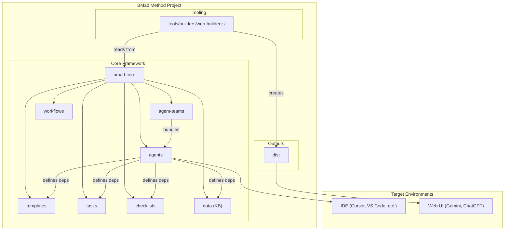

# Architecture — SurfAI (BMAD‑METHOD)

Status: Draft v0.1
Owner: Architect Agent (with Human-in-the-Loop)
Last Updated: 2025-10-28

## 1. Context & Objectives

SurfAI adopts BMAD‑METHOD to standardize planning and development:
- Agentic Planning (Analyst/PM/Architect) → PRD + Architecture
- Context‑Engineered Development (SM/Dev/QA) → Story‑centric execution

Objectives
- Provide a lean, shardable architecture foundation that supports IDE and Web UI agents.
- Enable bundling for web platforms and lean context usage in IDE.

## 2. Constraints & Assumptions

- Node.js ≥ 20 required for installer and tooling.
- IDE supports agent mentions or slash commands; web bundles for LLM platforms.
- Documentation must be shardable to fit LLM context limits.

## 3. High-Level Architecture

Core modules and flows are adapted from `core-architecture.md`.

## 4. Component Model

- Agents (`bmad-core/agents/*.md`)
  - Personas and capabilities with dependencies (templates, tasks, data, checklists).
  - Startup instructions can load project docs for immediate context.

- Agent Teams (`bmad-core/agent-teams/*.yaml`)
  - Bundles of agents for specific purposes (e.g., full‑stack team for web usage).

- Workflows (`bmad-core/workflows/*.yaml`)
  - Define sequences for planning and development (greenfield/brownfield).

- Reusable Resources
  - Templates: PRD, Architecture, User Story, QA Gate.
  - Tasks: `create-doc.md`, `shard-doc.md`, `advanced-elicitation.md`.
  - Checklists: PO/Architect alignment, QA rules.
  - Data: Knowledge base (`bmad-kb.md`), technical preferences.

- Tooling (`tools/builders/web-builder.js`)
  - Produces `.txt` bundles under `dist/` for Web UI upload.

## 5. Data & Documents

- Planning Artifacts
  - `docs/prd.md`, `docs/architecture.md`
  - Sharded Epics: `docs/epics/`
  - Sharded Stories: `docs/stories/`
  - QA: `docs/qa/assessments/`, `docs/qa/gates/`

- Technical Preferences
  - `.bmad-core/data/technical-preferences.md` influences agent recommendations.

## 6. Interfaces (Examples)

- IDE Agent Commands
  - `@pm` create PRD from brief
  - `@architect` derive architecture from PRD (+ optional UX)
  - `@sm` draft next story from shards
  - `@dev` implement story tasks and tests
  - `@qa` run `*risk`, `*design`, `*trace`, `*nfr`, `*review`, `*gate`

- Web Bundles
  - Upload `dist/teams/team-fullstack.txt` to LLM platforms; follow `/help` for commands.

## 7. Non-Functional Requirements (NFR)

- Security: No secrets in repo; follow least privilege.
- Performance: Keep bundles and contexts lean; avoid unnecessary content.
- Reliability: Deterministic tasks; no flaky tests.
- Maintainability: Shard documents; keep standards concise and updated.
- Observability (future): Optional CI lint/test hooks.

## 8. Risks & Mitigations

- Context Overflow → Use sharding and `devLoadAlwaysFiles` to limit always‑loaded documents.
- Planning Misalignment → Enforce PO alignment checklist before development.
- Quality Drift → QA gates with deterministic PASS/CONCERNS/FAIL; use waivers only with justification.
- Version Instability (v6‑alpha) → Prefer v4 stable for production; evaluate v6 on a separate branch.

## 9. Tech Stack Preferences (Initial)

- Language/Runtime: Node.js 20+ for tooling; app stack TBD via PRD domain work.
- IDE: Cursor/Windsurf/VS Code or similar with Mermaid preview.
- Testing: Unit, integration, E2E guided by QA *design; no hard waits; self‑cleaning tests.

## 10. Operational Guidance

- Installation/Updates
  - `npx bmad-method install` or `git pull && npm run install:bmad`
- Sharding
  - PO shards `docs/prd.md` and `docs/architecture.md` into `docs/epics/*`, `docs/stories/*`, `docs/architecture/*.md`
- Core Config
  - `.bmad-core/core-config.yaml` → set `devLoadAlwaysFiles` with: `docs/architecture/coding-standards.md`, `tech-stack.md`, `project-structure.md`

## 11. Appendix

- References: `core-architecture.md`, `user-guide.md`, upstream BMAD‑METHOD repo.
